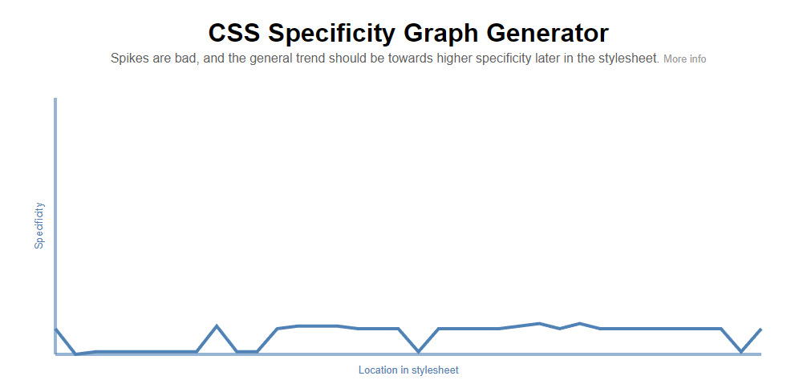

# Frontend Mentor - Recipe page solution.

This is a solution to the [Recipe page challenge on Frontend Mentor](https://www.frontendmentor.io/challenges/recipe-page-KiTsR8QQKm). 

## Table of contents

- [Overview](#overview)
  - [The challenge](#the-challenge)
  - [Screenshot](#screenshot)
  - [Links](#links)
- [My process](#my-process)
  - [Built with](#built-with)
  - [What I learned](#what-i-learned)
  - [Continued development](#continued-development)
  - [Useful resources](#useful-resources)
- [Author](#author)
- [Acknowledgments](#acknowledgments)


## Overview

### Screenshot


### Links

- Solution URL: [https://franciscomi.github.io/recipe-page-main/](https://your-solution-url.com)

## My process

### Built with

- Semantic HTML5 markup
- CSS custom properties


### What I learned

CSS media queries are very useful when you want your design to be responsive.

It has been difficult, if not impossible, to make the image take up the full width of the screen when switching to mobile design.

The solution I found was to create a container class with a 10vw padding in the desktop version, and then set it to 0 in the media query.

```html
<body class="container">
  <main class="card">
    
    <section>
```

```css
.container{
  background-color: var(--body-color);
  position: relative;
  padding:10vw;
}

.card__image{
  width: 100%;
  border-radius: 10px;
}

@media only screen and (max-width:525px){
  .card__image{
    border-radius: 0;
    margin: 0;
  }

  .container{
    min-width: 320px;
    background-color: inherit;
    padding: 0;
  }
}
```

### Useful resources

- [https://jonassebastianohlsson.com/specificity-graph/](https://jonassebastianohlsson.com/specificity-graph/) - This web is great to analize the specificity of my CSS. The more speaks there are, the easier it is to break the design when modifying the CSS.




## Author

- Frontend Mentor - [@FranciscoMi](https://www.frontendmentor.io/profile/FranciscoMi)
<<<<<<< HEAD


=======
>>>>>>> d12357de32d05f3155fe08a9b8d003deb374cff1
